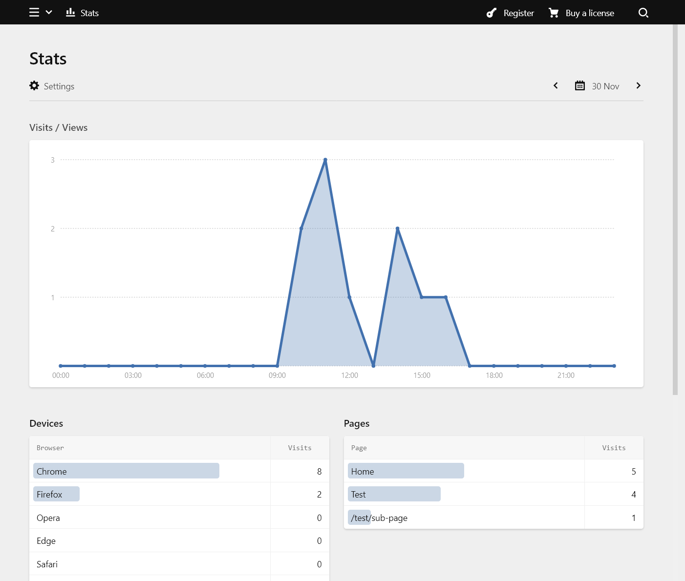

# Kirby Stats

> :warning: This plugin is still in alpha, a lot of features are still missing or not completed yet.

Kirby stats is a simple, privacy friendly Kirby 3 plugin for tracking page views and visits.



## Note

I'm no lawyer and can't give you any legal advice regarding GDPR. I can only tell you what data the plugin is collecting.
For each page view various counters are increased for a specified time interval. For example, after the first user has visited your website the data would be:

| path | time          | views | visits | Firefox | Windows |
| :--- | :------------ | :---- | :----- | :------ | :------ |
| /    | unixtimestamp | 1     | 1      | 1       | 1       |

- `path` is the url path
- `unixtimestamp` is the time of the interval you choose to track. For example if you track hourly, the `unixtimestamp` would be the beginning of the current hour.
- `views` will increase for each page view, except reloads
- `visit` will only increase if a user visits your website either from a blank tab or via a link from another website. To determine if a request counts as a visit, the user's referrer is checked (but not saved). This also means that these aren't unique visits like in many other tracking plugins. If the same person visits your website two times in a day you will see two visits.
- `Firefox`, `Opera`, `MicrosoftEdge`, `InternetExplorer`, `Safari` or `Chrome` will be increased for each visit depending on the user's browser (the user agent is used to determine this).
- `Windows`, `Mac`, `Linux`, `Android`, `iOS` will be increased for each visit depending on the users's operating system (the user agent is used to determine this).

That's it. No IP address is stored and no cookie is set by this plugin. And also no unique requests, all data is grouped into time intervals. If a second user visits in the same hour, the counters are increased accordingly. If a user visits in the following hour or later a new row of counters is created in the table.

Please checkout the source code and decide for yourself what this means for your privacy statement and GDPR.

## Installation

```sh
composer require arnoson/kirby-stats
```

## Usage

Also see the `/example` folder, documentation is still WIP.

The plugin provides an endpoint `/kirby-stats/hit` which gets called from a little [script](https://github.com/arnoson/kirby-stats/blob/main/example/assets/stats.js). Simply add the script to your website and include it in your templates like shown in the example.

## Options

```php
// site/config.php
[
  'arnoson.kirby-stats' => [
    // Enable or disable tracking. This is useful to disable tracking in local
    // development by using Kirby's multi environment config setup:
    // https://getkirby.com/docs/guide/configuration#multi-environment-setup
    'enabled' => true,

    // The time interval in which to group the collected data. Use the default
    // 'hour' if you are interested in how your visits/views change during the
    // day, or something like 'week' if don't really care about the details.
    // Allowed values: 'hour', 'day', 'week', 'month', 'year'.
    'interval' => 'hour',

    // Where to (automatically) create the database. Default is
    // '/storage/stats.sqlite' for public folder setups or
    // '/site/storage/stats.sqlite' for normal setups.
    'sqlite' => dirname(__DIR__) . '/some-file-path.sqlite',
  ],
];
```

Note: if you want to use Kirby's roots to define the database location use
Kirby's [ready](https://getkirby.com/docs/reference/system/options/ready) callback:

```php
[
  'ready' => fn() => [
    'arnoson.kirby-stats.sqlite' => kirby()->root('site') . '/stats.sqlite',
  ],
];
```

# Credits

- https://github.com/FabianSperrle/kirby-stats
- https://github.com/Daandelange/kirby3-simplestats
